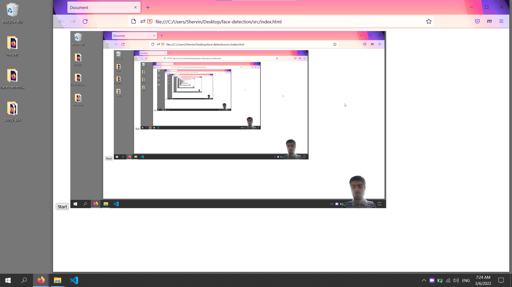

# ScreenShare & body-fix (v1.2)
1400.12 
 
ScreenShare with Instrauctor Face and Pose (no background)

## this branch (v1.2)

* [x] change `ml5.faceAPI` to `body-pix` from tfjs 

## improvement

* [x] always show webcam, just change on detect
* [x] data combine screen, webcam then on mother

## preview

