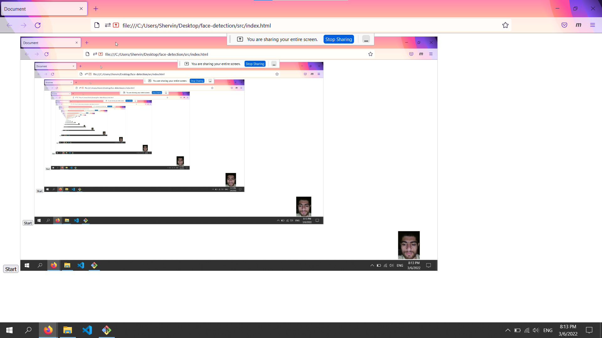

# ml5.js > faceApi

* no phiphon needed 
* at middle error `promise` in `sketch.js` or `ml5.min.js` occure!

## image processing libs

* ml5.js (Now)
* opencv > opencv.js > cv
* tensorflow > tensorflow.js > tf

## preview



## to change

### ctx stroke

``` 
// ctx.strokeStyle = "blue";
// ctx.stroke();
// ctx.lineWidth = 10;
```

### draw face (in for loop)

```
// ===================================
//    stroke face
// ===================================

const mouth = detections[i].parts.mouth;
const nose = detections[i].parts.nose;
const leftEye = detections[i].parts.leftEye;
const rightEye = detections[i].parts.rightEye;
const rightEyeBrow = detections[i].parts.rightEyeBrow;
const leftEyeBrow = detections[i].parts.leftEyeBrow;

//
// drawPart(mouth, true);
// drawPart(nose, false);
// drawPart(leftEye, true);
// drawPart(leftEyeBrow, false);
// drawPart(rightEye, true);
// drawPart(rightEyeBrow, false);

// 
function drawPart(feature, closed) {

    ctx.beginPath();

    for (let i = 0; i < feature.length; i += 1) {
    var x = feature[i]._x, y = feature[i]._y;
    if (i == 0){ctx.moveTo(x, y)} else {ctx.lineTo(x, y)}
    }

    if (closed == true){ctx.closePath()}

    ctx.stroke();

}
    
```


